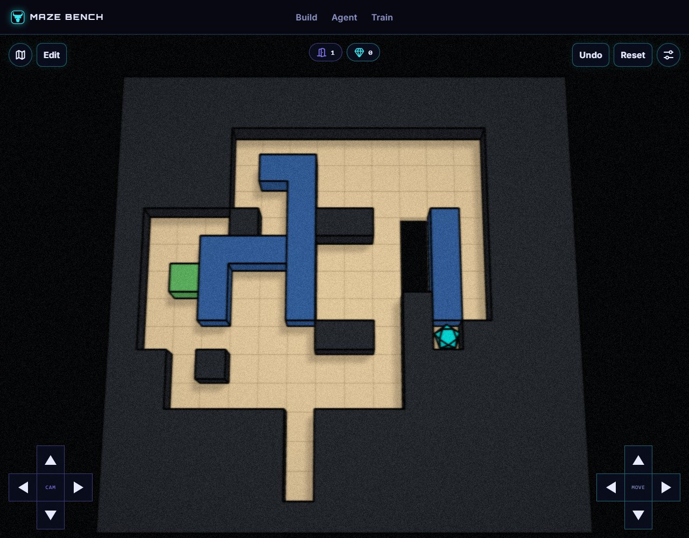

# Borrowed Bay: The Returning Keeper

Phase: **after**. Kind: **authoring trial**. Status: **historical checks passed**.

A new composed room from an independent authoring trial using the revised skills: tool retreat, helper parking, delivery, lateral transfer, helper recovery, and tool withdrawal. The witness has 81 inputs and 23 pushes. This is practical-use evidence, not a controlled improvement estimate.

Recorded witness: 81 inputs. This is not a human-difficulty rating or an optimality claim.

## Files

- [Build map](world.json)
- [spec.json](spec.json)
- [contract.json](contract.json)
- [solution.txt](solution.txt)
- [level_AxA.txt](level_AxA.txt)
- [boundary-verification.json](boundary-verification.json)
- [browser.json](browser.json)
- [case-summary.json](case-summary.json)
- [extended-verification-attempt-01.json](extended-verification-attempt-01.json)
- [extended-verification.json](extended-verification.json)
- [packaged-audit/browser-baseline.json](packaged-audit/browser-baseline.json)
- [packaged-audit/verification-baseline.json](packaged-audit/verification-baseline.json)
- [verification.json](verification.json)

## How to read this record

Import `world.json` into your own MazeBench Build environment, or ask a coding agent to create a fresh draft using the official save services. Historical draft IDs and manifest routes are provenance, not hosted playable links. Read the [usage guide](../../../../../docs/using-skills.md) for setup.

Historical reports are retained, including failed or capped attempts. Their scopes differ; a later passing report does not make every earlier attempt a pass. Editing a layout or changing the engine requires new checks. This publication did not rerun all historical solvers or conduct human playtests.
