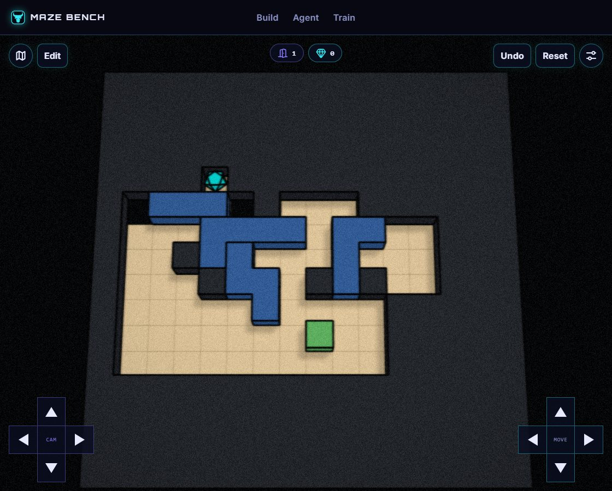

# Skill Trial 04 - Linked Workshop

Phase: **before**. Kind: **authoring trial**. Status: **historical checks passed**.

Boundary-dependent offsets, tool transport, and contact transfer are connected in one room. Includes supplemental composition checks.

Recorded witness: 58 inputs. This is not a human-difficulty rating or an optimality claim.

## Files

- [Build map](world.json)
- [spec.json](spec.json)
- [contract.json](contract.json)
- [level_AxA.txt](level_AxA.txt)
- [browser.json](browser.json)
- [supplemental-verification.json](supplemental-verification.json)
- [verification.json](verification.json)

## How to read this record

Import `world.json` into your own MazeBench Build environment, or ask a coding agent to create a fresh draft using the official save services. Historical draft IDs and manifest routes are provenance, not hosted playable links. Read the [usage guide](../../../../../docs/using-skills.md) for setup.

Historical reports are retained, including failed or capped attempts. Their scopes differ; a later passing report does not make every earlier attempt a pass. Editing a layout or changing the engine requires new checks. This publication did not rerun all historical solvers or conduct human playtests.
