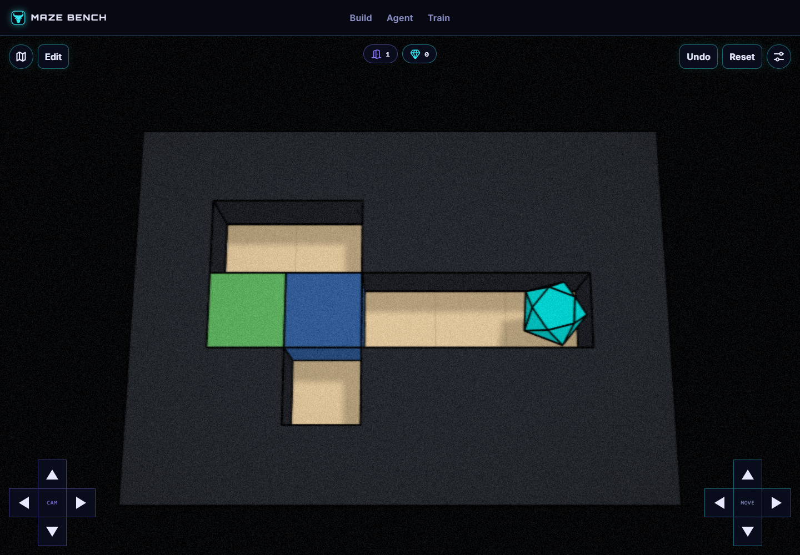

# Agent Practice - Push into Alcove

Phase: **before**. Kind: **early practice**. Status: **historical witness retained**.

A 7-by-5 introductory room. The documented witness is URDRRR. This predates the revision and is not a controlled comparison sample.

Recorded witness: 6 inputs. This is not a human-difficulty rating or an optimality claim.

## Files

- [Build map](world.json)

## How to read this record

Import `world.json` into your own MazeBench Build environment, or ask a coding agent to create a fresh draft using the official save services. Historical draft IDs and manifest routes are provenance, not hosted playable links. Read the [usage guide](../../../../../docs/using-skills.md) for setup.

Historical reports are retained, including failed or capped attempts. Their scopes differ; a later passing report does not make every earlier attempt a pass. Editing a layout or changing the engine requires new checks. This publication did not rerun all historical solvers or conduct human playtests.
