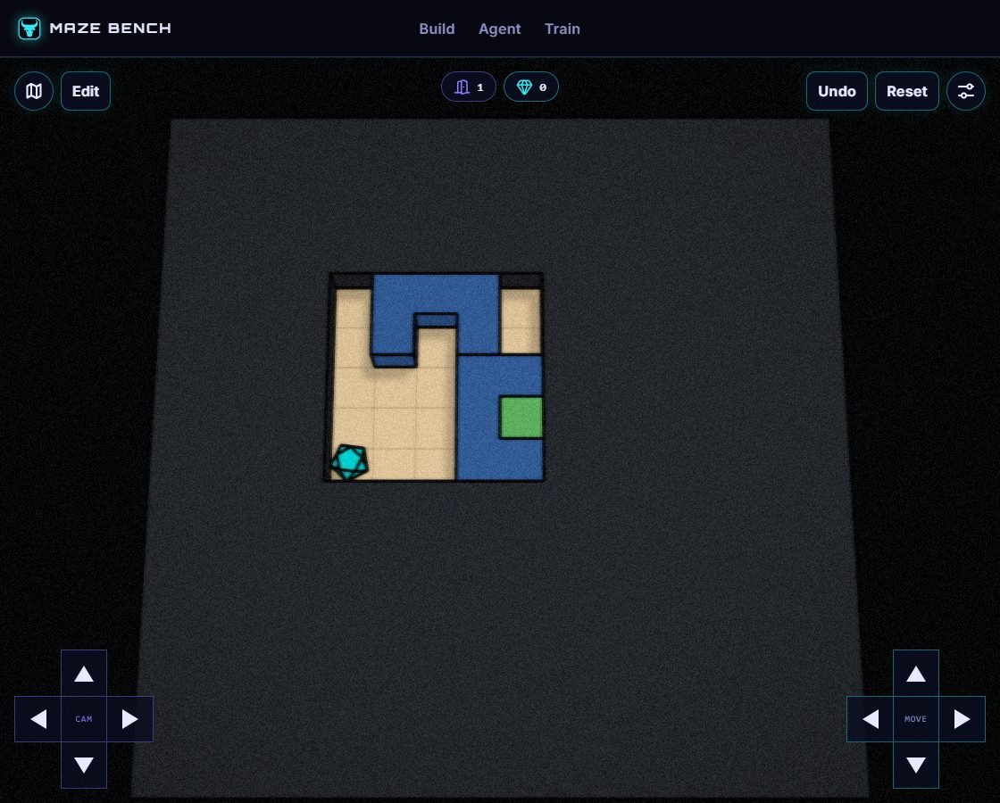

# pocket-shutter

Phase: **before**. Kind: **earlier skill example**. Status: **historical checks passed**.

An authored boundary-stagger fixture, with contract, replay, and scoped controls.

Recorded witness: 17 inputs. This is not a human-difficulty rating or an optimality claim.

## Files

- [Build map](world.json)
- [contract.json](contract.json)
- [evidence/browser.json](evidence/browser.json)
- [evidence/verification.json](evidence/verification.json)

## How to read this record

Import `world.json` into your own MazeBench Build environment, or ask a coding agent to create a fresh draft using the official save services. Historical draft IDs and manifest routes are provenance, not hosted playable links. Read the [usage guide](../../../../../docs/using-skills.md) for setup.

Historical reports are retained, including failed or capped attempts. Their scopes differ; a later passing report does not make every earlier attempt a pass. Editing a layout or changing the engine requires new checks. This publication did not rerun all historical solvers or conduct human playtests.
